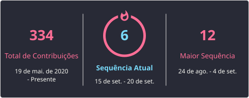

# Olá, eu sou Eduardo Hernandes 👋

- 🔭 Professor de Informática para Internet e Desenvolvimento de Sistemas na rede SENAI-PE / SESI-PE.
- 🔭 Professor Universitário na Uninassau.
- 🎓 Tecnólogo em Sistemas para Internet (UNIFAAT-2013).
- 🎓 Especialista Lato-Sensu em Tecnologia e Inovações Web (UNIFAVENI-2024).
- 🎓 Licenciado em Matemática (UniBF-2025).
- ❤ Sou apaixonado por tecnologia, panificação artesanal, teologia e minha família.
- 🏃🏻 Corredor amador.
-  Vai Curintia!!!!

## Github Stats

## Top linguagens mais utilizadas

## GitHub Streak

## 🏆 Tecnologias

 
  
  
  
  
  
  
  
  

  
## 🌎 Onde me encontrar

  
  
  
  
 

 
Atualizacao 
